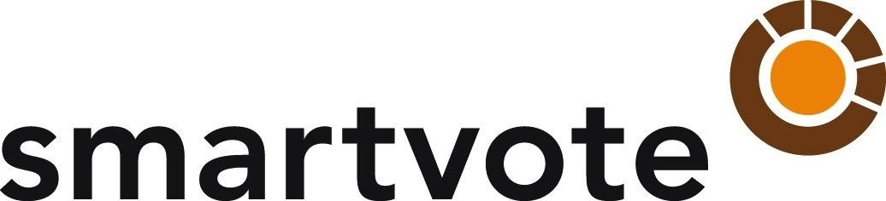

<center>
# Titelseite
<!-- [Wahlbezeichnung allg.] -->`r params$params_fliesstext$wahlbezeichnung_allg` vom <!-- [Wahldatum] -->`r params$wahldatum`

<!-- [Aktuelles Datum] -->`r params$aktuelles_datum`

```{r, out.width='50%', fig.align='center', echo=FALSE, message=FALSE, warning=FALSE}

```

smartvote
CH-3000 Bern

Tel. 033 534 99 15
kontakt@smartvote.ch
</center>

# Einleitung
Der Einsatz der Online-Wahlhilfe smartvote (www.smartvote.ch) bei den Wahlen vom <!-- [Wahldatum] -->`r params$wahldatum` wurde durch die <!-- [Gemeindebezeichnung] -->`r params$gemeindebezeichnung` finanziert. Aufgrund dieses Engagements konnten die Dienstleistungen von smartvote den Parteien und den Wahlberechtigten zur Verfuegung gestellt werden. <!-- [Optionaler Text 1] -->`r params$optionaler_text_1`

Die Online-Wahlhilfe smartvote ist ein Projekt des Vereins Politools (www.politools.net) mit Sitz in Bern. Politools ist nicht gewinnorientiert und politisch unabhaengig. Das smartvote-Projektteam setzt sich aus Expertinnen und Experten unterschiedlicher Fachrichtungen zusammen. Das Team steht fuer eine wissenschaftlich sorgfaeltige und qualitativ hochstehende Umsetzung der Online-Wahlhilfe.

Smartvote erfuellt zudem die Qualitaetsstandards der Lausanner Deklaration ueber Online-Wahlhilfen von 2013 und arbeitet eng mit Schweizer Universitaeten, Fachhochschulen und Forschungsprojekten zusammen. Institutionell ist das Projekt am Kompetenzzentrum fuer Public Management (KPM) der Universitaet Bern angegliedert. Fuer den Betrieb der Website und die konkreten Inhalte im Zusammenhang mit bestimmten Wahlen ist jedoch allein der Verein Politools verantwortlich.

Der vorliegende Bericht fasst die Eckwerte des Wahlhilfe-Projekts in der <!-- [Gemeindebezeichnung] -->`r params$gemeindebezeichnung` <!-- [Wahljahr] -->`r params$wahljahr` zusammen. Er basiert dabei vor allem auf Informationen aus den Datenbanken von smartvote und auf den offiziellen Wahlstatistiken.

# Projektziele
Die Online-Wahlhilfe smartvote bietet den Waehlerinnen und Waehlern eine auf Sachthemen ausgerichtete Orientierungshilfe, damit die Wahlentscheidung auf einer verbesserten Informationsgrundlage getroffen werden kann.

Gerade fuer junge Waehlerinnen und Waehler oder fuer Wahlberechtigte, welche die Politik nicht taeglich mitverfolgen, ist es nicht immer einfach, den ueberblick ueber die politischen Positionen der Kandidierenden zu bewahren. Die Online-Wahlhilfe schafft diesbezueglich Transparenz und bietet den Waehlerinnen und Waehlern eine Moeglichkeit, aus der Vielzahl von Listen und Kandidierenden diejenigen auszuwaehlen, die ihren politischen Praeferenzen am besten entsprechen.

In diesem Zusammenhang ist das Projektteam bemueht, im Rahmen der Ausarbeitung des Fragebogens darauf zu achten, dass dieser einen Fokus auf lokale und regionale Fragen aufweist und dass eine moeglichst breite Abdeckung von Themenbereichen erreicht wird, welche fuer die betreffende Wahl von politischem Interesse sind.

# Ablauf des Projektes
Im <!-- [Monat Jahr Offertstellung] -->`r params$monat_jahr_offertstellung` unterbreiteten die Betreiber der Online-Wahlhilfe smartvote der <!-- [Gemeindebezeichnung] -->`r params$gemeindebezeichnung` eine Offerte im Hinblick auf die Wahlen vom <!-- [Wahldatum] -->`r params$wahldatum`. Im <!-- [Monat Jahr Offertannahme] -->`r params$monat_jahr_offertannahme` erklaerte sich die <!-- [Gemeindebezeichnung] -->`r params$gemeindebezeichnung` bereit, die anfallenden Kosten von CHF <!-- [Kosten] -->`r params$kosten` zzgl. MWST fuer die Realisierung des Projekts zu uebernehmen.

In der Folge bestand eine enge und gute Zusammenarbeit mit den Vertretern der <!-- [Gemeindebezeichnung] -->`r params$gemeindebezeichnung` sowie den lokalen Parteien. Im <!-- [Monat Jahr Info an Parteien] -->`r params$monat_jahr_info_an_parteien` wurden alle Stadtparteien ueber die Anmeldung der Kandidierenden und die Einreichung von Themenvorschlaegen fuer den smartvote-Fragebogen informiert. Somit stand allen Parteien die Moeglichkeit offen, bei den smartvote-Betreibern Themenvorschlaege fuer den Fragebogen einzureichen. Aus Gruenden der politischen Unabhaengigkeit oblag die Erarbeitung der definitiven Fassung des Fragebogens jedoch allein den Wahlhilfe-Betreibern.

Nach Erhalt der notwendigen Informationen zu den einzelnen Kandidierenden wurden ab dem <!-- [Datum Start Kandidatenzugang] -->`r params$datum_start_kandidatenzugang` die Login-Daten zum smartvote-Benutzerkonto den Kandidierenden zugestellt. Am <!-- [Datum Start Waehler] -->`r params$datum_start_waehler` wurde die Webseite fuer die Wahlberechtigten aufgeschaltet. Bis zum Wahltag am <!-- [Wahldatum] -->`r params$wahldatum` blieb somit genuegend Zeit, um sich mit den Positionen der Kandidierenden und Parteien intensiv zu befassen. Negative Feedbacks auf den smartvote-Fragebogen und den Einsatz der Online-Wahlhilfe insgesamt sind uns nicht bekannt. Insgesamt kann der gesamte Projektablauf aus der Sicht der smartvote-Betreiber als sehr zufriedenstellend bezeichnet werden.

# Beteiligung der Kandidierenden
Von den insgesamt

```{r, echo=FALSE, message=FALSE, warning=FALSE, comment=NA, code = readLines("smartvote-00031-script-anzahl_kandidierende.R")}
```

Kandidierenden bei den <!-- [Wahlbezeichnung Parlament] -->`r params$wahlbezeichnung_parlament` haben

```{r, echo=FALSE, message=FALSE, warning=FALSE, comment=NA, code = readLines("smartvote-00032-script-anzahl_kandidierende_confirmed.R")}

```
ein smartvote-Profil erstellt. Die Teilnahmequote betraegt somit

```{r, echo=FALSE, message=FALSE, warning=FALSE, comment=NA, code = readLines("smartvote-00033-script-anzahl_kandidierende_confirmed_perc.R")}

```
, was im Vergleich zu anderen Einsaetzen der Wahlhilfe einen <!-- [Textauswahl 1] -->`r params$textauswahl_1` Wert darstellt. <!-- [Optionaler Text 2] -->`r params$optionaler_text_2` Weitere Details finden sich in der Abbildung 1. <!-- [Optionaler Text 3] -->`r params$optionaler_text_3`

Abbildung 1: smartvote-Beteiligung der Kandidierenden bei den <!-- [Wahlbezeichnung Parlament] -->`r params$wahlbezeichnung_parlament` nach Listen.

```{r, echo=FALSE, message=FALSE, warning=FALSE, results='asis', booktabs = TRUE, code = readLines("smartvote-00035-script-anzahl_liste.R")}
```

Weitere Auswertungen zur Beteiligung der Kandidierenden finden sich im Anhang dieses Berichts.

# Nutzung durch Waehlerinnen und Waehler
Insgesamt wurden bei den <!-- [Wahlbezeichnung allg.] -->`r params$wahlbezeichnung_allg` <!-- [Anzahl Wahlempfehlungen alle Wahlen] -->`r params$anzahl_wahlempfehlungen_alle_wahlen` smartvote-Wahlempfehlungen ausgestellt. <!-- [Optionaler Text 4] -->`r params$optionaler_text_4`

Bei den <!-- [Wahlbezeichnung Parlament] -->`r params$wahlbezeichnung_parlament` kamen auf <!-- [Anzahl gueltige Stimmzettel] -->`r params$anzahl_gueltige_stimmzettel` gueltig eingegangene Stimmzettel <!-- [Anzahl Wahlempfehlungen Parlamentswahl] -->`r params$anzahl_wahlempfehlungen_parlamentswahl` bei smartvote ausgestellte Wahlempfehlungen – dies wuerde unter den effektiven Wahlteilnehmer/-innen einer smartvote-Nutzungsquote von rund <!-- [smartvote-Nutzungsquote] -->`r params$smartvote_nutzungsquote`% entsprechen.

Diese Zahl kann allerdings nur als ungefaehre Richtschnur dienen, da diese Berechnung auch Mehrfachnutzerinnen und -nutzer beinhaltet. Die Forschung konnte im Rahmen von eidgenoessischen Wahlen aufzeigen, dass gemaess neustem Stand rund 20% der Wahlteilnehmer/-innen die Online-Wahlhilfe smartvote nutzen. Diese Zahl wird auch auf kommunaler Ebene regelmaessig erreicht und duerfte sich auch in der [Gemeindebezeichnung] auf diesem Niveau bewegen.

# Anhang: Detaillierte Auswertungen

## Merkmale der Kandidierenden

### Alter
Das Durchschnittsalter der Kandidierenden betraegt:

```{r, echo=FALSE, message=FALSE, warning=FALSE, comment=NA, code = readLines("smartvote-00011-script-durchschnittsalter_alle_kand.R")}
```

Das Durchschnittsalter der Gewaehlten betraegt:

```{r, echo=FALSE, message=FALSE, warning=FALSE, comment=NA, code = readLines("smartvote-00012-script-durchschnittsalter_elected_kand.R")}
```

In der folgenden Grafik ist die Altersverteilung der Kandidierenden dargestellt:

```{r, echo=FALSE, message=FALSE, warning=FALSE, fig.align='center', code = readLines("smartvote-00013-script_altersverteilung_kand.R")}
```

### Geschlecht
In der folgenden Grafik ist die Verteilung der Kandidierenden nach Geschlecht dargestellt:

```{r, echo=FALSE, message=FALSE, warning=FALSE, fig.align='center', code = readLines("smartvote-00021-script-geschlechterverteilung_kand.R")}
```

## smartvote-Beteiligung der Kandidierenden
Insgesamt haben sich

```{r, echo=FALSE, message=FALSE, warning=FALSE, comment=NA, code = readLines("smartvote-00031-script-anzahl_kandidierende.R")}
```

Kandidierende zur Wahl gestellt.

```{r, echo=FALSE, message=FALSE, warning=FALSE, fig.align='center', code = readLines("smartvote-00034-script-anzahl_vis.R")}
```

### Kandidierende nach Partei
```{r, echo=FALSE, message=FALSE, warning=FALSE, results='asis', booktabs = TRUE, code = readLines("smartvote-00036-script-anzahl_partei.R")}
```

### Kandidierende nach Wahlkreis

```{r, echo=FALSE, message=FALSE, warning=FALSE, results='asis', booktabs = TRUE, code = readLines("smartvote-00037-script-anzahl_wahlkreis.R")}
```

## smartvote-Profile der Kandidierenden

### Antworten auf die smartvote-Fragen

```{r, echo=FALSE, message=FALSE, warning=FALSE, results='asis', fig.align='center', code = readLines("smartvote-00041-script-antwortverteilung_alle_kand_standard-4.R")}
```

```{r, echo=FALSE, message=FALSE, warning=FALSE, results='asis', fig.align='center', code = readLines("smartvote-00042-script-antwortverteilung_gewaehlte_kand_standard-4.R")}
```

```{r, echo=FALSE, message=FALSE, warning=FALSE, results='asis', fig.align='center', code = readLines("smartvote-00043-script-antwortverteilung_alle_kand_budget-5.R")}
```

```{r, echo=FALSE, message=FALSE, warning=FALSE, results='asis', fig.align='center', code = readLines("smartvote-00044-script-antwortverteilung_gewaehlte_kand_budget-5.R")}
```

```{r, echo=FALSE, message=FALSE, warning=FALSE, results='asis', fig.align='center', code = readLines("smartvote-00045-script-antwortverteilung_alle_kand_slider-7.R")}
```

```{r, echo=FALSE, message=FALSE, warning=FALSE, results='asis', fig.align='center', code = readLines("smartvote-00046-script-antwortverteilung_gewaehlte_kand_slider-7.R")}
```
